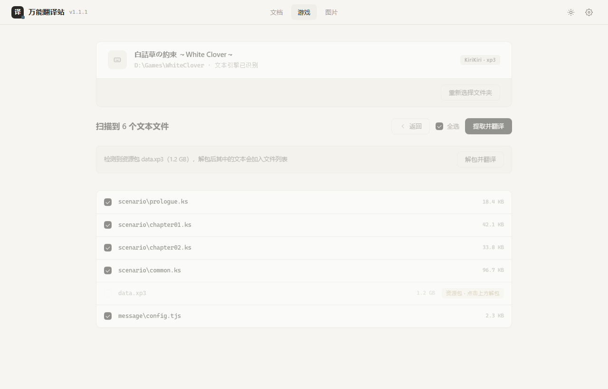
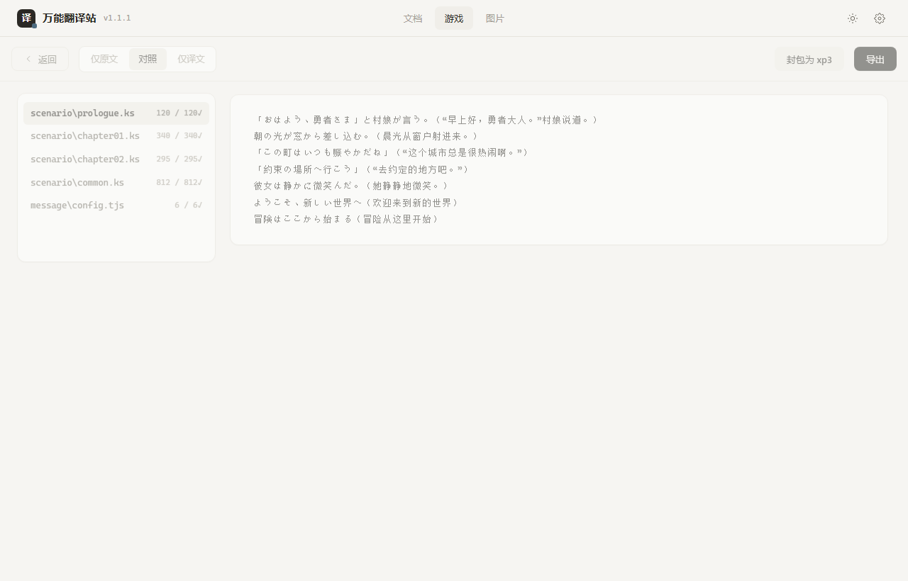

# Universal Translator

**A universal text translation tool for Windows desktop**: stop juggling between file managers and multiple translation apps. Just drag your files into the box — documents, games, or images — **detect → extract → translate → replace**, all in one place.





## Highlights

- **Drag & translate**: drop a file or a whole game folder into the window; it auto-scans and auto-detects the engine
- **Encoding auto-detection**: UTF-8 / UTF-16 / Shift-JIS (Japanese) / GBK (Chinese) — no manual transcoding for Japanese game scripts
- **Multi-format extraction**: txt / json / yaml / ini / srt / ass / rpy (Ren'Py) / ks (KiriKiri, incl. Japanese 「」 quotes)
- **xp3 archive unpacking**: game scripts locked inside .xp3? Unpack → translate → repack in one click (encrypted packs not supported yet)
- **Original encoding preserved**: exports keep the source encoding; falls back to UTF-8 with a hint when the target charset can't represent the translation
- **Multiple translation engines**: MyMemory (free) / Baidu / DeepL / OpenAI-compatible endpoints (local LLMs work too)
- **Per-file review**: file tree on the left, switch between Original / Bilingual / Translated views
- **Light & dark themes**: warm paper-light and graphite-dark, preference remembered
- **100% local**: everything happens on your machine; game files never leave your computer

## Roadmap

| Module | Status |
| --- | --- |
| Text file translation (txt/json/ini/srt/ass etc.) | ✅ Done |
| Game translation (engine detection + rpy/ks scripts + xp3 unpack/repack) | ✅ Done |
| Document translation (Word/PDF/Markdown) | 🔜 Planned |
| Image translation (OCR + text replacement) | 🔜 Planned |

## Download & Usage

Grab `UniversalTranslator.exe` from the [Releases](https://github.com/Match0121/universal-translator-desktop/releases) page and double-click it (Windows 10/11, no dependencies to install).

**"Unknown publisher" warning on first run**: click "More info → Run anyway". This is the standard prompt for unsigned software.

The in-app help and changelog live in Settings (⚙ top right) → Help / Changelog.

## Supported Files

- **Text files**: `txt` / `md` / `log` / `json` / `xml` / `yaml` / `ini` / `cfg` / `srt` / `ass` etc.
- **Game scripts**: `rpy` (Ren'Py), `ks` (KiriKiri)
- **Archives**: KiriKiri `xp3` (unpack → translate → repack; encrypted packs not supported)
- **Not yet**: text in images, Unity/UE asset packs, strings embedded in binaries

## Translation Engines

| Engine | Notes |
| --- | --- |
| MyMemory | Free, no config, daily quota |
| Baidu Translate | Stable in China, free tier, requires APP ID + secret |
| DeepL | Requires API key |
| OpenAI-compatible | Local LLMs (Ollama / LM Studio etc.) |

## Development

```powershell
pip install pywebview
python desktop.py
```

Falls back to the system browser automatically if the embedded window is unavailable.

Build: run `build.bat`; output goes to `dist\UniversalTranslator.exe`.

## Changelog

### v1.1.1 (2026-08-14)
- Help section now lists the full supported-file scope

### v1.1.0 (2026-08-14) · First official release
- New minimal-premium UI (warm paper background, ink buttons, mist-steel-blue accents, light & dark themes)
- Encoding auto-detection — no manual transcoding for Japanese games
- KiriKiri xp3 unpack & repack
- Exports preserve original encoding
- Back buttons on scan/browse screens; in-app help & changelog
- Semantic versioning x.x.x

## License

[MIT](LICENSE)
