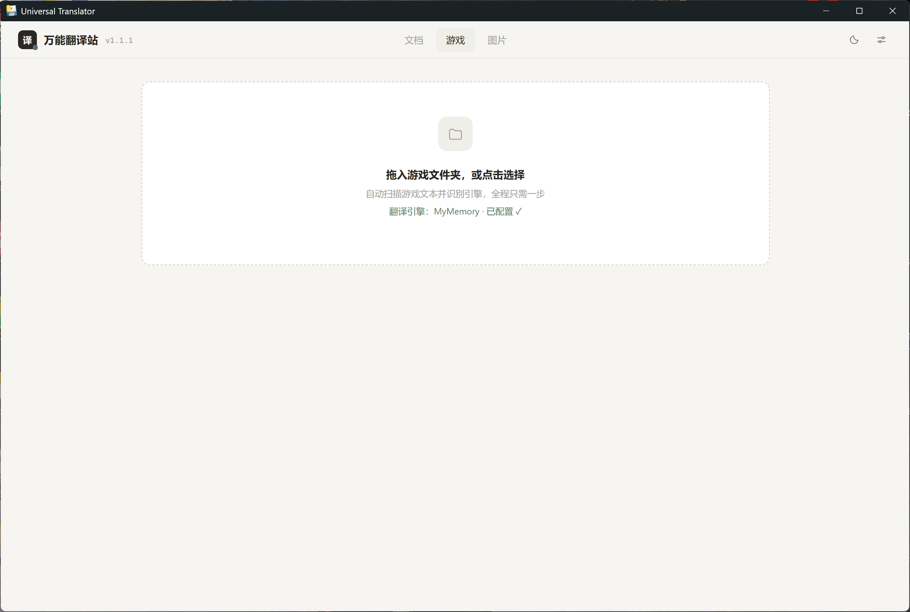

# 万能翻译站 · Universal Translator

> Windows 桌面端全能翻译工具：文件、文档、游戏、图片，拖入即译。
> Drag in files, documents, games or images — detect, extract, translate, done.



## 亮点

- **拖入即译**：文件或整个游戏文件夹拖进窗口，自动扫描、自动识别，无需挑选
- **文档翻译**：Word / Excel / PPT / EPUB / PDF / HTML / Markdown / TXT；PDF 自动分类，文本型直接提取、扫描件走 OCR；PDF 导出保持原排版——文本型原位替换译文，扫描件整页渲染成图后覆盖译文
- **图片翻译**：PNG / JPG / WebP / BMP 拖入即 OCR，图上标注三态查看（仅原文 / 对照 / 仅译文），导出 TXT / Markdown / 译文标注图
- **保存对话框**：导出时先弹系统另存为选位置（单文件），多文件批量直接下载
- **游戏翻译**：Ren'Py / 吉里吉里剧本自动识别，xp3 解包 → 翻译 → 封包回写；编码自动检测（UTF-8 / UTF-16 / Shift-JIS / GBK），日文剧本免转码
- **多翻译引擎**：MyMemory（免费免配置）/ 百度 / DeepL / OpenAI 兼容接口（本地 LLM 也可）
- **完全本地**：所有处理本机完成，文件不出电脑；深浅双主题偏好自动记忆

## 快速开始

1. 从 [Releases](https://github.com/Match0121/universal-translator-desktop/releases) 下载 `UniversalTranslator.exe`（Windows 10/11，无需安装任何依赖）
2. 双击运行。首次提示「未知发布者」时点「更多信息 → 仍要运行」（未签名软件的标准提示，属正常现象）
3. 把文件或文件夹拖进窗口，等待扫描、翻译，导出译文

使用说明与更新日志已内置：右上角 ⚙ 设置。

## 支持的输入

| 类别 | 格式 | 说明 |
| --- | --- | --- |
| 文本文件 | txt / md / log / json / yaml / ini / cfg / srt / ass | 导出保持原编码写回 |
| 游戏剧本 | rpy（Ren'Py）、ks（吉里吉里） | 引擎自动识别 |
| 资源包 | xp3（吉里吉里） | 解包 → 翻译 → 封包回写；加密包不支持 |
| 文档 | docx / xlsx / pptx / epub / html / pdf | PDF 文本型 / 扫描件自动分流；文字层乱码时可强制图片 OCR |
| 图片 | png / jpg / webp / bmp | OCR 识别文字 + 三态标注 + 标注图导出 |

暂不支持：Unity/UE 等引擎资源包、程序内嵌字符串。

## 翻译引擎

| 引擎 | 说明 |
| --- | --- |
| MyMemory | 免费免配置，有每日额度 |
| 百度翻译 | 国内稳定，免费额度，需 APP ID + 密钥 |
| DeepL | 需 API Key |
| OpenAI 兼容接口 | 可接本地 LLM（Ollama / LM Studio 等） |

## 开发

```powershell
pip install pywebview
python desktop.py
```

内嵌窗口不可用时自动回退到系统浏览器（功能不变）。

打包：双击 `build.bat`，产物在 `dist\UniversalTranslator.exe`。

## 更新日志

### v1.3.0 (2026-08-25)
- **新增图片翻译工作台**：PNG / JPG / WebP / BMP 拖入即 OCR，三态标注视图，导出 TXT / Markdown / 译文标注图
- **PDF 智能分类**：文字层 / 扫描件 / 空白自动分流；扫描件自动 OCR（150dpi + 模型复用提速）
- **PDF 原排版导出**：文本型原文原位擦除嵌入译文；扫描件整页渲染成图、按图片翻译方式覆盖译文；未翻译内容原样保留
- **PDF 提取方式可选**：文字层 / 图片 OCR（文字层乱码时强制逐页识别）
- **导出保存对话框**：单文件导出先弹系统另存为选位置
- **目标语言感知**：目标语言非中文时，中文原文正常送译
- **背景色自适应**：深色卡片等复杂背景上覆盖不再露白块，译文自动反色

### v1.2.0 (2026-08-17)
- **新增文档翻译**：Word / Excel / PPT / EPUB / HTML / Markdown / TXT，拖入即译，保留原格式导出
- 翻译缓存管理：2 万条自动上限（LRU 裁剪）+ 设置一键清除
- 中文行自动跳过，消除虚假失败计数
- UI 打磨：拖拽框统一、进度条保留完成态、返回按钮统一左上角、双栏严格对齐
- JSZip 本地化，离线也能导出

### v1.1.1 (2026-08-14)
- 使用说明补充「支持翻译的文件」范围清单

### v1.1.0 (2026-08-14) · 首个正式版本
- 全新「高级简约」界面：暖灰纸感、墨色主按钮、雾钢蓝点缀，深浅双主题
- 文件编码自动检测，日文游戏免转码
- 吉里吉里 xp3 资源包解包 + 封包
- 导出保持原编码写回
- 版本号采用 x.x.x 三位格式

## License

[MIT](LICENSE)